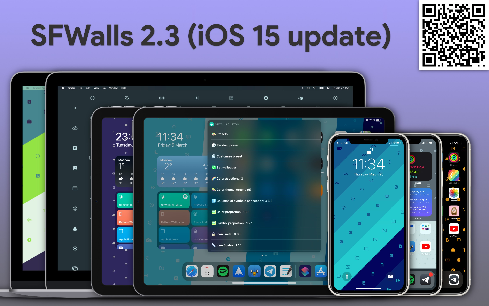

# SFWalls




## Create unique wallpapers using Apple's SF Symbols

Created by [@glebosotov](https://github.com/glebosotov) and [@AzazKamaz](https://github.com/AzazKamaz) 

The easiest way to contact us is Telegram 

### Features:

- Create randomized custom wallpapers for your iPhone, iPad and Desktop
- Make your own presets or use **built-in themes**
- Create **automations** to have different wallpaper every time you [open Twitter / Sleep / Leave home]

### Requirements:

- [Scriptable app](https://scriptable.app)

### Links:

- [Custom shortcut with advanced settings](https://routinehub.co/shortcut/8607/)
- [One-click shortcut for automation](https://routinehub.co/shortcut/8608/)
- [Shortcut for generating Desktop wallpapers](https://routinehub.co/shortcut/8609/)
- [Desktop gradient wallpapers](https://routinehub.co/shortcut/8865/) (requires shortcut above)


### ✨ New in 2.0

- **categories** of symbols or individual user-defined symbols
- **import** a preset using **text input** or **iCloud**
- **export** a preset to **clipboard**, iCloud or **save in the shortcut** itself
- link to help and documentation inside the shortcut
- built-in update system using [this](https://routinehub.co/shortcut/2672/)

### ✨ New in 2.1

- **UI improvements** when setting wallpaper
- New menu item: 🎲 Random preset with random color
- New menu item: 🎨 Make **custom gradient color theme**
- Overall **refactoring** with new **comments**, lots of polish and **optimisations**

### ✨ New in 2.2

- New file-keeping system with [this](https://routinehub.co/shortcut/8794/) to migrate

### ✨ New in 2.3

- Support for iOS 15 and SFSymbols version 3 (793 new symbols)


## Guide to all settings/parameters:

### Desktop version:

- Copy the  `Desktop` folder in the repo to the `SFWalls` folder in Shortcuts directory
  - `DesktopColors.json` – color themes
  - `DesktopPresets.json` – presets
  - `DesktopSymbols.json`  - symbol categories
  - `DesktopGradient.json` - gradient colors for Desktop Gradient shortcut
- The default behaviour is: for each preset in the `DesktopPresets.json` there will be created a wallpaper with every color theme from `DesktopColors.json`
- The wallpapers will be saved to  `iCloud/Shortcuts/SFWalls/Results`


### Advanced shortcut:

#### 🎨 Presets

Choose from a **predefined set of themes**, icons are differene every time (you cah change those at the beginning of the shortcut, there is a Text block with JSON)

#### 🎲 Random Preset

**Randomly choose** one of the predefined themes

#### 🎲 Random Preset with random color

**Randomly choose** one of the predefined themes and **randomly choose colors** for it

#### ⚙️ Customise presets

Choose a preset and **change some values**, then set the wallpaper. Edits are **not** permanent.

#### ✅ Preview and Set wallpaper

**Preview** current preset and **set** wallpaper or continue messing with the settings.

#### 🌈 Colors/sections

**Amount of colors/sections**. All arrays must contain the same amount of elements as there are secions *(not tested otherwise, may lead to a crash)*

#### 🎨 Color theme

Choose from a predifined **set of color themes**. Can be edited, saved as a JSON text at the beginning of the shortcut.

#### 🎨 Make custom gradient color theme

Either **enter two hex values** or **choose from a set** of predefined colors from JSON at the start of the script.

Then, a second inline script will generate a set of colors for the gradient (seamlessly).

#### 🔢 Columns per sections

Array of **columns per section**. Column as a blank space between the symbols. For example two columns is one pile/column of symbols. 4 is 3 piles...

#### 🖼 Color proportion

Array defining **proportions of colors/sections**. For example [1, 2, 1] means that middle section will be twice as big is the others.

#### 🖼 Symbol proportion

Array defining **proportions of symbol sections**. For example [1, 2, 1] means that middle section of symbols will be twice as big is the others. If it is different from Color Proportion, the symbols will overlap with other section.

#### 🔒 Icon limits

Local **limit on set of symbols** (array with limit for each color/section). 0 means unlimited

#### 📏 Icon Scales

Array of **scales of icons**. Scales per sections. For example [0.5, 1, 0.7].

#### 📐 Section angle

Angle of colors/sections

#### 📐 Symbol rotation

Angle of symbol columns

#### 📐 Symbol color rotation

Angle of symbol coloring

#### 🔒 Limited amount of symbols

**Global limit** on set of symbols (for example the whole wallpaper could be created using just 1 random symbol). 0 means unlimited

#### 🈲 Global symbol category

Specify the Global theme for symbols

Categories are kept in JSON at the start of the shortcut

#### 🈲 Symbol category per section

Specify the Symbol Categoies (full list below). 
– Use `#` to specify the name of exact symbol
– Use *space* to separate names 
– Use `;` to separate colors/sections
– Use `.outlined` or `.filled` after category name
– Leave a section blank to make it empty

*An example:*
`#applelogo Health.outlined ; Communication.filled ; Gaming.filled`

Categories are kept in JSON at the start of the shortcut

#### ⤴️ Export a preset

Choose a method to **save currently edited preset**

- Save your preset to a user-defined location and use it later within the 🎨 **Presets** action.
  - default location is `Shortcuts/SFWalls/Custom/CustomPresets.json`
- Save it to clipboard (without a name, perfect for ⬇️ **Import a preset** action)
- Save it as a separate text file (without a name, perfect for ⬇️ **Import a preset** action)

#### ⬇️ Import a preset

Run shortcut with a **predefined preset**. It **should not have a name** only an array with parameters like this

```json
{
  "symbolColorAngle": 90,
  "category": "Communication.filled",
  "orientation": "Portrait",
  "iconScales": [1, 1, 1],
  "symbolAngle": 90,
  "limitSymbols": 0,
  "colorAngle": 90,
  "themeName": "black and white (5)",
  "colors": 3,
  "columns": [4, 6, 3],
  "symbolProportion": [550, 1000, 250],
  "iconLimits": [0, 0, 0],
  "colorProportion": [550, 1000, 250]
}
```

- from a **text input**

- from an **iCloud** text **file**


### Auto version:

The only **setting**: there is a number block at the start. Set it to `1` to randomize color theme every time, set to `0` to load color theme from preset.  

This version **randomly chooses** from presets (can be changed, saved as JSON text at the start), then sets the wallpaper to both Home and Lock Screen. No user action required, can be used with **Automations** or by **double-tapping the back** of your iPhone (Settings -> Accessibility -> Touch -> Back Tap -> Double Tap -> SFWalls auto).


### Disable auto-update system:

**Delete repeat 1 time block** at the start of the shortcut (with all actions inside)


### How `colors.json` works:

There are **two types** of color themes:

One has one array for both foreground (symbol coloring) and background (colors/sections). One has two arrays for more custimisation. `Shuffle` boolean makes the order random every time and `Shift` int indeicates what color will be first, when coloring symbols or sections. For example the code below means that the colors will be painted starting from second array element (index 1) and symbols will be painted starting from the first element (index 0)

```json
"bgShift": 1,
"fgShift": 0
```


```json
"original": {
    "bgColors": ["#1d2f6f", "#8390fa", "#fac748", "#f9e9ec", "#f88dad"],
    "bgShuffle": false,
    "fgColors": ["#f88dad", "#fac748", "#1d2f6f", "#8390fa", "#f9e9ec"],
    "fgShuffle": false
  }
```

```json
"funky future (8)": {
    "colors": [
      "#2b0f54",
      "#ab1f65",
      "#ff4f69",
      "#fff7f8",
      "#ff8142",
      "#ffda45",
      "#3368dc",
      "#49e7ec"
    ],
    "shuffle": false,
    "bgShift": 1,
    "fgShift": 0
  }
```


### How `symbols.json` works:

There is an "*All*" dictionary. Do not touch it, it contains all symbols. 

Others have the following structure:

```json
"name":{
  "filled":["symbol1","symbol2"],
  "outlined":["symbol1","symbol2"]
}
```

Where *filled* contains the symbols that will be used with category (in config) `name.filled` and  *outlined* contains the symbols that will be used with category `name.outlined`

## Troubleshooting:

In the early versions with far worse symbol tinting algorithm Shortcuts app often "killed" Scriptable process because of memory restrictions and script did not return anything. This should not happen with this version, but if it does – **limit the symbols amount**.

Another option is to write to either @AzazKamaz or @glebosotov on Telegram or use GitHub's built-in features.
